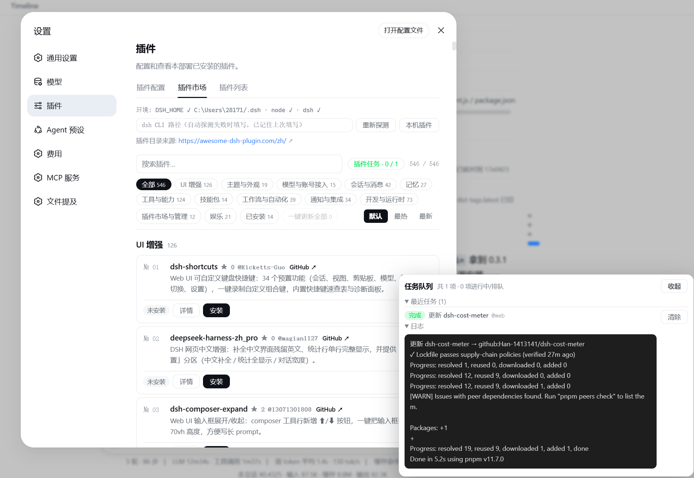

# dsh-webui-market-plugin[](https://awesome-dsh-plugin.com)

> **[中文](README.md)** | English

An in-harness community plugin market for the dsh web GUI: browse the awesome-dsh-plugin.com catalog and install/uninstall plugins into a profile from **Settings → Plugins → Plugin Market**. The UI matches the harness frontend style (follows the system light/dark theme) and supports both Chinese and English (switched automatically by system language).

Prefer the awesome-dsh-plugin.com implementation: [dsh-market](https://github.com/dsh-market/dsh-market).

## Screenshot



## Install

Option 1: install from the **npm registry** (recommended; no git clone / prepare script involved):

```sh
dsh plugin --profile web add @sanqi-normal/dsh-webui-market-plugin
```

Option 2: install from the GitHub source:

```sh
dsh plugin --profile web add github:Sanqi-normal/dsh-webui-market-plugin
```

**Restart the web service** after installing to take effect:

```sh
pnpm dsh web
```

Installing from GitHub runs the package's prepare script. If pnpm blocks it, add the prompted package name to `allowBuilds` in the profile's `pnpm-workspace.yaml` and retry.

Since pnpm 11, any package whose build script is not explicitly allowed or rejected in `allowBuilds` will cause `ERR_PNPM_IGNORED_BUILDS` and abort the install. If the package does not need to run its build script in the current profile, set the entry to `false` (explicitly reject) instead of `true` (allow running). The plugin's trial-boot validation inherits the real web profile's `pnpm-workspace.yaml`, so this `true`/`false` decision also applies to the trial environment.

## Usage

Open **Settings → Plugins → Plugin Market**:

- The catalog is grouped by category, with search and an "Installed" filter. Each card shows the GitHub star count (hidden when unavailable), and can be sorted by **Hottest (stars descending, starless items last) / Newest (date added)**, or restored to the website's default order. Large catalogs are rendered progressively in batches to avoid jank when inserting hundreds of cards at once
- Click **Details** to see the plugin's official install command (including the target profile)
- **Cross-profile install / one-click sync (desktop, etc.)**: the official catalog only publishes `--profile web` commands, but desktop shells start their own independent profile (e.g. `desktop`), so plugins installed into web are not loaded automatically by desktop apps. At the top of the panel there are **Install Settings** (with explanations) and a **Cross-profile Sync** area that lists all locally initialized profiles:
  - **"Install everywhere" by default**: the "Auto-sync to other profiles" toggle in Install Settings is **on by default** — installing a plugin also installs it into every initialized profile on the machine (web gets web, desktop gets desktop; picking desktop directly in the confirm dialog also back-fills web). Turning it off installs only into the profile selected at install time
  - The **install confirm dialog** lets you pick the target profile (default: web). The **Cross-profile Sync** area back-fills plugins already installed in web into a target profile (only adds missing entries)
  - Sync is a **local copy**: the source was already installed in the source profile (validated via `syncFrom`), so it is not subject to the catalog whitelist — plugins installed in web but not in the curated catalog (e.g. aegis) can also be synced. Every back-fill task goes through the usual pre-install snapshot + FIFO queue, and the target app must be restarted to take effect
- **Install / Update / Uninstall** form a FIFO task queue: multiple plugins can be queued in a row. The task panel is pinned to the bottom-right corner and never scrolls away, showing live status ("queued / validating / running / completed / failed / terminated / timed out"). You can cancel queued items, terminate running ones, and view each task's pnpm log. Each task times out automatically after 120 seconds by default (raise it via the `DSH_MARKET_OP_TIMEOUT_MS` env var, e.g. `300000`). Transient pnpm network errors (`GET ... error` / `ETIMEDOUT` / `ECONNRESET`, etc.) trigger an **automatic retry**; persistent failures show proxy/mirror troubleshooting hints. **Update All** queues every updatable plugin in turn. The "Clear" button at the head of the queue removes all completed/failed records at once (one-by-one clearing also works); clearing is synced to the server so the records won't reappear after a refresh or reopen
- **Ask DSH on failure**: after a failed install / update / uninstall (including timeout, terminated, or rejected), the failure dialog and the failed row in the task queue show an **Ask DSH** button. Clicking it opens a new chat and automatically sends the operation target, status, environment info, and the full error log as a prompt to the AI for troubleshooting or explanation
- **pnpm ≥11 minimumReleaseAge policy**: pnpm enables a 24-hour `minimumReleaseAge` supply-chain policy by default, so packages published within the last 24 hours block all install/update/uninstall operations. On `ERR_PNPM_MINIMUM_RELEASE_AGE_VIOLATION`, the market automatically merges the offending `name@version` into `minimumReleaseAgeExclude` in the profile's `pnpm-workspace.yaml` (multiple versions of the same name are written as `name@v1||v2` to avoid pnpm only honoring the first rule for that name) and retries once — no manual config needed
- **Disable / Enable**: disabling keeps dependencies and disk files and only moves the plugin out of the active bundle layer (it stays disabled after restart); enabling restores it in its original order without reinstalling. Card actions are laid out horizontally at the bottom of each card to avoid a cramped right-side button column
- **Local plugins**: lists all dependency-managed plugins (including those installed outside the market, plus client-only / plain dependencies that never entered the bundle layer), marked with in-catalog / out-of-catalog, disabled state, and source type. You can disable, enable, or uninstall them directly (built-in bundles and local link/file sources don't offer deletion)
- Each plugin card shows its real installed state (synced with the profile's `package.json`): install state is matched by "author + repo" (`owner/repo`). When the catalog contains same-named plugins (e.g. two authors' `dsh-memory`), only the one actually installed is marked as installed — the other author's card is not mislabeled. The "Local plugins" list also shows the resolved `owner/repo` identity
- The top of the panel links to the official catalog website

## How it works

Persistent bundle (`dsh.bundle.patch` in `package.json` → `cordis.patch.yml`), added to the profile's `dsh.profile.bundles` layer automatically by `dsh plugin add`'s reconcile:

- **Host half** (`lib/host.js`): registers the `/api/dsh-market` routes, providing `list` (reads the official JSON API `plugins.json`, falling back to a bundled offline snapshot on failure; includes stars/added — same as the official dsh-market: try the live JSON, then the stale cache, then the offline snapshot, never parse the website HTML), `probe` (environment probe, including the list of locally initialized profiles), `installed` / `installedAll` (reads profile package.json and installed package manifests), `syncPlan` (read-only cross-profile diff: plugins installed in web but missing in the target profile), `install` / `update` / `updateAll` / `uninstall` (FIFO queue + background `dsh plugin` CLI spawns; the whitelist is enforced at the queue head for **all profiles**, trial boot only for web), `disable` / `enable` (disable/enable and persist to `dsh.market.disabled`), `op` (queue snapshot), `kill` (terminate/cancel tasks)
- **Client half** (`lib/client.js`): declared via `exports["./client"]` + `dsh.client` so the web frontend loads it, registered into the `settings.plugins.tab` slot

## Safety and limitations

- **Source whitelist**: installs only accept `github:` sources listed in the curated registry (awesome-dsh-plugin.com). Anything outside the catalog is rejected, matching the whitelist policy of [dsh-market](https://github.com/dsh-market/dsh-market) (catalog fetch failures and registry/link sources are exempt). The whitelist applies to **all target profiles** (including desktop sync); checking "Skip security check" is the only way around it
- **npm first (same mirror strategy as the official site)**: when a catalog entry has an `npm` mapping, installing/updating prefers the npm package name (npm tarballs go through CDNs/mirrors and don't depend on GitHub downloads). Only GitHub-only plugins without an npm release use the GitHub source. Users can set a domestic registry mirror in npm/pnpm config (e.g. `registry=https://registry.npmmirror.com`), and npm-source installs/updates will automatically use it
- **Trial boot**: after passing the whitelist, if the plugin does not declare a web client half (`dsh.client.platform === 'web'`), a **trial boot** runs first: it rebuilds the composition in a temporary DSH_HOME using the web profile template, installs the candidate plugin with the same `dsh plugin add`, then actually starts it with `--port 0` (a free system port). The plugin is only accepted once the `dsh web:` ready line appears (printed only after the Loader tree resolves). On failure you get the **real startup error** (e.g. duplicate api-gateway / webserver) and the install is rejected — the real profile is never written and the trial directory is cleaned up automatically, with no rollback needed. **Trial boot only runs for the web profile**: non-web profiles (e.g. desktop) have their composition defined by the corresponding desktop shell, which the market cannot replicate in a temporary environment, so their installs are guarded by "source whitelist + pre-install snapshot" (equally non-destructive, just without a startup verdict). The trial environment inherits the real web profile's `pnpm-workspace.yaml` (`allowBuilds` / `minimumReleaseAgeExclude`), so build scripts explicitly rejected (`false`) in the real profile will not be re-allowed or executed during the trial
- **Cross-profile sync only adds, never removes**: `syncPlan` only computes "installed in web, missing in target" plugins and requires the target profile to be initialized (avoiding accidental empty-profile creation). Sync only back-fills — it never deletes or downgrades anything already in the target profile. Sync installs carry a `syncFrom` source check: it is only allowed when the target source is indeed an installed dependency of the source profile (a local copy, not a new remote-trust decision); entries that fail the check still go through the catalog whitelist. After installing into profiles like desktop, restart the corresponding app to take effect
- **Same-origin check**: the write operations `install` / `uninstall` / `update` / `kill` only accept same-origin POSTs (Origin header matching Host); cross-origin requests always get 403
- **Hot mount (no restart)**: after a successful install, if the new plugin's `cordis.patch.yml` consists of plain `id`/`name` insertion lines, the market tries to mount it into the running composition and **refreshes the page automatically** (no manual steps). For complex patches or unsupported environments it falls back to "restart to apply". Hot-mount inputs are stored in `<profile>/.dsh-market/` and cleaned up on every startup. Hot mount, hot uninstall, and Loader disable/enable only affect the running **web** profile; operations on other profiles like desktop never touch web's runtime state
- **Update detection and updating**: installed plugin cards automatically show an "Update" button (github sources compare the lockfile-pinned commit against GitHub HEAD; registry sources compare npm latest against the installed version; local link/file sources are not checked). Clicking it re-resolves the latest version and runs it as a background task; it takes effect on the next restart after completion. Detection failures silently degrade to "no update" and never block the list. For github sources, the update writes the detected HEAD commit as `github:owner/repo#<sha>` before running, avoiding `Permission denied (publickey)` when pnpm resolves HEAD via `git ls-remote` (SSH) without a configured SSH key
- **Offline catalog snapshot**: `data/catalog-snapshot.json` serves as the offline fallback when fetching the website fails. Refresh it directly from the official JSON API with `pnpm run snapshot` (this bypasses the fallback chain — it fails if the website is unreachable instead of copying stale data)
- **Automatic pre-install snapshot**: before writing to any profile, `package.json` is backed up as `.mkts-snapshot-<timestamp>.json` in the same directory (cross-profile sync and "skip security check" installs are backed up too). Combined with `dsh plugin --profile <name> remove <pkg>`, you can roll back manually
- **CI=true**: pnpm subprocesses run in CI mode to avoid silently hanging on interactive prompts without a TTY
- **Network timeout control**: pnpm subprocesses use shorter `fetch-timeout` (30s) and `fetch-retries` (1) by default, preventing endless "GET ... error retry" loops from dragging tasks to their timeout on weak networks. Override with `DSH_MARKET_FETCH_TIMEOUT_MS`, `DSH_MARKET_FETCH_RETRIES`, `DSH_MARKET_FETCH_RETRY_MINTIMEOUT_MS`, `DSH_MARKET_FETCH_RETRY_MAXTIMEOUT_MS`. Frontend `/api/dsh-market` requests time out after 30 seconds by default so the panel cannot hang on external network issues
- **Disable persistence**: disabled state is written to `dsh.market.disabled` in the profile's `package.json` (dependencies kept, removed from `dsh.profile.bundles`); the market re-applies this set on startup and after every pnpm operation. Note: running `dsh plugin add/remove/update` manually on the command line triggers reconcile which briefly re-enables disabled items; a restart or the next market operation disables them again
- A restart of the web service is required after install/uninstall to take effect (except for successful hot mounts; this plugin never restarts automatically)
- Catalog data comes from the official JSON API (`plugins.json`, same source as [dsh-market](https://github.com/dsh-market/dsh-market), including star counts), falling back via "stale cache → bundled offline snapshot" on fetch failure (same strategy as the official dsh-market; the website's HTML static pages are never parsed). The plugin count and categories follow the official website
