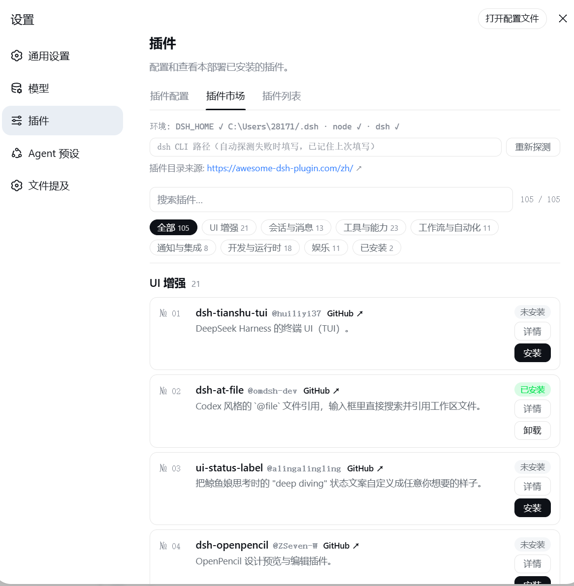

# dsh-webui-market-plugin

在 dsh web GUI 内部的社区插件市场：浏览 [awesome-dsh-plugin.com](https://awesome-dsh-plugin.com/) 的插件目录，直接在 **设置 → 插件 → 插件市场** 里安装 / 卸载插件到 profile。界面风格与 harness 前端一致（跟随系统深浅色主题），支持中英文（按系统语言自动切换）。

An in-harness community plugin market for the dsh web GUI: browse the awesome-dsh-plugin.com catalog and install/uninstall plugins into a profile from **Settings → Plugins → Plugin Market**.

## 效果展示 Screenshot



## 安装 Install

方式一：从 **npm registry** 安装（推荐，无 git 克隆 / prepare 脚本步骤）：

```sh
dsh plugin --profile web add @sanqi-normal/dsh-webui-market-plugin
```

方式二：从 GitHub 源码安装：

```sh
dsh plugin --profile web add github:Sanqi-normal/dsh-webui-market-plugin
```

安装后**重启 web 服务**生效：

```sh
pnpm dsh web
```

GitHub 源安装会执行包内 prepare 脚本，如被 pnpm 拦截，把提示的包名加入 profile 的 `pnpm-workspace.yaml` 的 `allowBuilds` 后重试。

## 使用 Usage

打开 **设置（Settings）→ 插件（Plugins）→ 插件市场（Plugin Market）**：

- 目录按分类分组，支持搜索与"已安装"过滤
- 点 **详情** 查看该插件的官方安装命令（含目标 profile）
- **安装 / 卸载** 以弹窗形式确认，任务后台执行、实时显示 pnpm 输出，可最小化到后台、随时终止；超过 120 秒自动超时报错
- 每个插件卡片显示真实的已安装状态（与 profile 的 `package.json` 同步）
- 顶部显示插件目录来源官网链接，可直接打开


## 工作原理 How it works

持久化 bundle（`package.json` 的 `dsh.bundle.patch` → `cordis.patch.yml`），由 `dsh plugin add` 的 reconcile 自动加入 profile 的 `dsh.profile.bundles` 层：

- **Host 半**（`lib/host.js`）：注册 `/api/dsh-market` 路由，提供 `list`（抓取并解析官网目录）、`probe`（环境探测）、`installed`（读取 profile package.json）、`install` / `uninstall`（后台 spawn `dsh plugin` CLI）、`op`（轮询任务状态）、`kill`（终止任务）
- **Client 半**（`lib/client.js`）：通过 `exports["./client"]` + `dsh.client` 声明被 web 前端加载，注册到 `settings.plugins.tab` 槽位

## 安全与限制 Safety and limitations

- **完整应用类插件会被拦截**：安装前会抓取 GitHub manifest 分类（raw.githubusercontent.com 失败时自动回退 raw.gitmirror.com），面向其他 profile 的完整应用（如 TUI 客户端，含 `@deepseek-ai/dsh-agent` 等依赖且无 web client 声明）装进 web 会与内置应用冲突导致启动失败（重复 api-gateway），面板会拒绝并给出对应 profile 的安装建议；确认来源可信时也可在确认弹窗勾选"跳过完整应用类型检查"（风险自负）
- 安装 / 卸载后需重启 web 服务生效（本插件不做自动重启）
- 目录数据来自官网静态页解析，官网无 JSON API；插件数量与分类以官网为准

## 开发 Development

本地开发用 link 方式装进 profile：

```sh
dsh plugin --profile web add link:C:/绝对路径/dsh-webui-market-plugin
```

测试：

```sh
npm test    # node --test tests/*.test.mjs
```

## 发布 Publishing

包名 `@sanqi-normal/dsh-webui-market-plugin`（npm 作用域必须小写；GitHub 仓库为 `Sanqi-normal/dsh-webui-market-plugin`），`repository` / `homepage` / `bugs` / `LICENSE` 均已填好。

发布前检查：

1. `npm publish --dry-run` 确认发布内容只含 `lib/`、`cordis.patch.yml`、`README.md`、`LICENSE`、`package.json`、`img/`（README 效果图）
2. npm 账号需拥有 `@sanqi-normal` 作用域（npm 用户名通常与 GitHub 相同；不一致时先创建同名 npm 账号或改 scope）
3. 推送 GitHub 后，安装验证：`dsh plugin --profile web add github:Sanqi-normal/dsh-webui-market-plugin`；发布 npm 后验证：`npm view @sanqi-normal/dsh-webui-market-plugin`，registry 安装：`dsh plugin --profile web add @sanqi-normal/dsh-webui-market-plugin`

> 包名是本地 profile 中的依赖键：本地改名前需重新 `dsh plugin --profile web remove @sanqi-normal/dsh-webui-market-plugin && dsh plugin --profile web add link:本目录`（或直接装 GitHub 源）。
